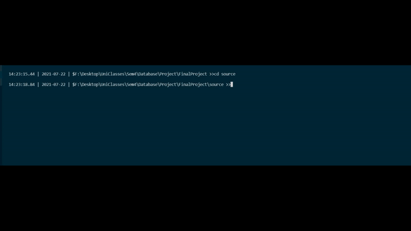

# DB-Final-Project

My database final project at AUT.CEIT

    

## Project
The main idea was to create a strem website database, where we have some 
movies and users, and a single admin.

Users can search movies, watch them, put comments for them and also list them.

Admin can add, remove or edit the movies.

Check the project <a href="./schema/README.md">Schema</a> for more information about how the project is implement.