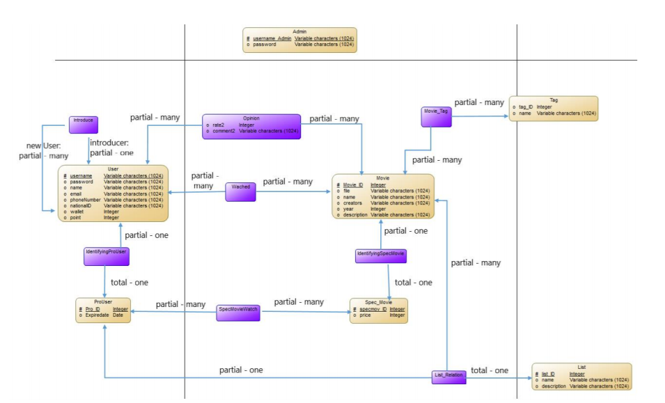

# Schema

This is the project schema where I select the entities and define the relations between them.

After all I represent the ER-Diagram of the project.

## Entities and Relations
- <a href="./entities.md">Entities</a>
- <a href="./relations.md">Relations</a>

## ER-Diagram

